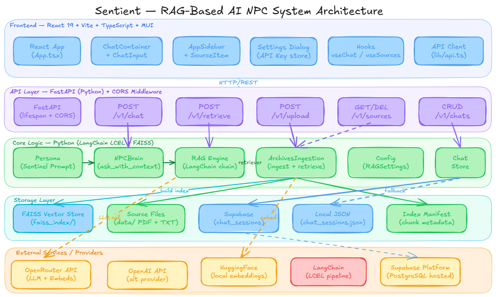

# Sentient

Sentient is a sophisticated RAG (Retrieval-Augmented Generation) based AI NPC system. It empowers developers to bring their game worlds to life by uploading game manuals, custom instructions, and dialogue style PDFs. This data is processed by a robust RAG engine and made accessible via a RESTful API, allowing NPCs to deliver personalized, conversational dialogues that remain contextually accurate to the game's lore and character personas.

## Key Features

- 📁 **Dynamic Document Upload** - Easily ingest game manuals and custom style PDFs to expand NPC knowledge.
- 💬 **Context-Aware Dialogues** - Generation of responses via RESTful API that are grounded in your uploaded documentation.
- 🎮 **Real-time Integration** - Seamlessly connects with live game instances for interactive NPC experiences.
- 🔍 **Semantic Search** - FAISS-backed retrieval with configurable OpenRouter/OpenAI/HuggingFace embeddings and document chunking tuned for RAG.
- 🧠 **Personalized Personas** - RAG-driven intelligence that shapes unique character voices and behaviors.

## Tech Stack

- **Backend:** FastAPI (Python), LangChain, OpenRouter, FAISS
- **Frontend:** Vite + React (TypeScript), MUI
- **Infrastructure:** RESTful API, Docker-ready

## Achievements & Impact

- **Achievements:** Advanced RAG-based NPC Interaction.
- **Impact:** Revolutionizing In-game NPC Conversations with Dynamic Knowledge Integration.

## System Design



## Architecture

```text
sentient/
├── api.py                  # FastAPI backend server
├── npc_brain.py            # Core brain logic
├── logic/
│   ├── ingestion.py        # Document ingestion with FAISS
│   ├── persona.py          # AI persona configuration
│   └── rag_engine.py       # RAG engine implementation
├── data/                   # Document storage, FAISS index, local chat fallback
└── frontend/               # Vite + React UI
    ├── src/
    │   ├── components/     # React components
    │   ├── hooks/          # Custom hooks
    │   ├── lib/            # Utilities & API client
    │   └── types/          # TypeScript types
    └── package.json
```

## Quick Start

### 1. Backend Setup

```bash
# Install dependencies using uv (Recommended)
uv sync

# OR using pip
# pip install fastapi uvicorn python-multipart python-dotenv langchain-openai langchain-community faiss-cpu sentence-transformers

# Set environment variables
cp .env.example .env
# Edit .env with your API keys (OPENROUTER_API_KEY is preferred)

# Start backend server
uv run uvicorn api:app --reload
```

### 2. Frontend Setup

```bash
cd frontend

# Install dependencies
npm install  # (or bun install / yarn)

# Start development server
npm run dev
```

### 3. Open App

Visit [http://localhost:5173](http://localhost:5173) (if using Vite) or [http://localhost:3000](http://localhost:3000) (if using Next.js).

## Environment Variables

### Backend (.env)

```env
OPENROUTER_API_KEY=your_api_key
OPENROUTER_BASE_URL=https://openrouter.ai/api/v1
LLM_PROVIDER=auto
EMBEDDING_PROVIDER=auto
MODEL_NAME=openai/gpt-4o-mini
EMBEDDING_MODEL_NAME=openai/text-embedding-3-small
RAG_TOP_K=4
RAG_FETCH_K=12
RAG_MMR_LAMBDA=0.65
SUPABASE_URL=your_supabase_project_url
SUPABASE_SERVICE_ROLE_KEY=your_supabase_service_role_key
```

The backend defaults to OpenRouter-compatible chat completion with `openai/gpt-4o-mini`, uses OpenRouter embeddings by default when an OpenRouter key is available, falls back to OpenAI embeddings for OpenAI keys, and falls back to local HuggingFace embeddings when no hosted embedding provider is configured. Vectors are stored in a local FAISS index under `data/faiss_index`.

Uploads and deletions rebuild the FAISS index from the current files under `data/`, write an index manifest, and keep retrieval aligned with the actual source documents and embedding configuration.

### Supabase Chat Storage

Create a `chat_sessions` table before using persistent chat history:

```sql
create extension if not exists pgcrypto;

create table if not exists public.chat_sessions (
    id uuid primary key default gen_random_uuid(),
    client_id text not null,
    title text not null,
    preview text not null default '',
    messages jsonb not null default '[]'::jsonb,
    created_at timestamptz not null default now(),
    updated_at timestamptz not null default now()
);

create index if not exists chat_sessions_client_id_updated_at_idx
    on public.chat_sessions (client_id, updated_at desc);
```

The frontend stores a browser-scoped `client_id` locally and uses it to list and reopen previous chats through the backend. If Supabase is not configured, the backend transparently falls back to local JSON chat storage under `data/chat_sessions.json`.

## API Endpoints

| Method | Endpoint                 | Description               |
| ------ | ------------------------ | ------------------------- |
| GET    | `/health`                | Health check              |
| POST   | `/v1/chat`               | Send chat message         |
| POST   | `/v1/retrieve`           | Inspect retrieved chunks  |
| POST   | `/v1/upload`             | Upload document (PDF/TXT) |
| GET    | `/v1/sources`            | List uploaded sources     |
| DELETE | `/v1/sources/{filename}` | Delete a source           |
| GET    | `/v1/chats`              | List saved chats          |
| GET    | `/v1/chats/{chat_id}`    | Load one saved chat       |
| POST   | `/v1/chats`              | Create a saved chat       |
| PUT    | `/v1/chats/{chat_id}`    | Update a saved chat       |
| DELETE | `/v1/chats/{chat_id}`    | Delete a saved chat       |

`/health` now reports the active LLM provider, embedding provider, retrieval mode, local vs Supabase chat storage, and index manifest metadata so you can confirm the runtime configuration quickly.

## License

MIT
