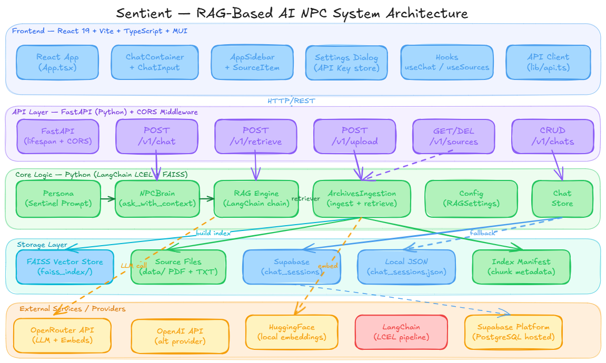

# Sentient

Sentient is a sophisticated RAG (Retrieval-Augmented Generation) based AI NPC system. It empowers developers to bring their game worlds to life by uploading game manuals, custom instructions, and dialogue style PDFs. This data is processed by a robust RAG engine and made accessible via a RESTful API, allowing NPCs to deliver personalized, conversational dialogues that remain contextually accurate to the game's lore and character personas.

## Key Features

- 📁 **Dynamic Document Upload** - Easily ingest game manuals and custom style PDFs to expand NPC knowledge.
- 💬 **Context-Aware Dialogues** - Generation of responses via RESTful API that are grounded in your uploaded documentation.
- 🎮 **Real-time Integration** - Seamlessly connects with live game instances for interactive NPC experiences.
- 🔍 **Semantic Search** - FAISS-backed retrieval with configurable Google Gemini/OpenAI/HuggingFace embeddings and document chunking tuned for RAG.
- 🧠 **Personalized Personas** - RAG-driven intelligence that shapes unique character voices and behaviors.

## Tech Stack

- **Backend:** FastAPI (Python), LangChain, FAISS, Google Gemini / OpenAI / HuggingFace (auto-selected or explicit)
- **Frontend:** Vite + React (TypeScript), MUI
- **Infrastructure:** RESTful API, Docker-ready

## Achievements & Impact

- **Achievements:** Advanced RAG-based NPC Interaction.
- **Impact:** Revolutionizing In-game NPC Conversations with Dynamic Knowledge Integration.

## System Design



## Architecture

```text
sentient/
├── api.py                  # FastAPI backend server
├── npc_brain.py            # Core brain logic
├── run_rag.py              # Manual CLI smoke-test for the RAG pipeline (not part of the API)
├── logic/
│   ├── config.py           # Env-driven settings & provider resolution
│   ├── ingestion.py        # Document ingestion with FAISS
│   ├── openai_adapter.py   # OpenAI-compatible /v1/chat/completions adapter
│   ├── persona.py          # AI persona configuration
│   ├── rag_engine.py       # RAG engine implementation
│   └── sqlite_chat_store.py # Local chat history fallback (used when Supabase isn't configured)
├── data/                   # Source PDFs (tracked) + generated FAISS index & local chat DB (gitignored)
└── frontend/               # Vite + React UI
    ├── src/
    │   ├── components/     # React components
    │   ├── hooks/          # Custom hooks
    │   ├── lib/            # Utilities & API client
    │   └── types/          # TypeScript types
    └── package.json
```

## Quick Start

### 1. Backend Setup

```bash
# Install dependencies using uv (Recommended)
uv sync

# OR using pip
# pip install fastapi uvicorn python-multipart python-dotenv langchain-openai langchain-community faiss-cpu sentence-transformers

# Set environment variables
cp .env.example .env
# Edit .env with your API keys (GOOGLE_API_KEY is preferred)

# Start backend server
uv run uvicorn api:app --reload
```

### 2. Frontend Setup

```bash
cd frontend

# Install dependencies
npm install  # (or bun install / yarn)

# Start development server
npm run dev
```

### 3. Open App

Visit [http://localhost:5173](http://localhost:5173) (if using Vite) or [http://localhost:3000](http://localhost:3000) (if using Next.js).

## Environment Variables

### Backend (.env)

```env
GOOGLE_API_KEY=your_api_key
OPENAI_API_KEY=your_api_key
HUGGINGFACEHUB_API_TOKEN=your_api_key
OPENAI_BASE_URL=
LLM_PROVIDER=auto
EMBEDDING_PROVIDER=auto
MODEL_NAME=gemini-2.5-flash
EMBEDDING_MODEL_NAME=models/gemini-embedding-2
OPENAI_TIMEOUT_SECONDS=60
DATA_DIR=data
FAISS_INDEX_PATH=data/faiss_index
RAG_SEARCH_TYPE=similarity
RAG_TOP_K=4
RAG_FETCH_K=12
RAG_MMR_LAMBDA=0.65
RAG_SCORE_THRESHOLD=0.2
RAG_CHUNK_SIZE=900
RAG_CHUNK_OVERLAP=150
SUPABASE_URL=your_supabase_project_url
SUPABASE_SERVICE_ROLE_KEY=your_supabase_service_role_key
NEON_AUTH_JWKS_URL=        # blank => auth disabled, single "default" user
NEON_AUTH_ISSUER=          # Neon Auth base_url (token `iss`)
NEON_AUTH_ALGORITHMS=EdDSA,RS256
```

#### Choosing an LLM / embedding provider

Sentient supports three providers and picks between them automatically — you don't have to hardcode one:

| `LLM_PROVIDER` / `EMBEDDING_PROVIDER` | When it's used | Default chat model | Default embedding model |
| --- | --- | --- | --- |
| `auto` (default) | Resolved per-request: an explicit request API key is checked by prefix first (`AIza...` → Google, `hf_...` → HuggingFace, anything else → OpenAI); otherwise whichever of `GOOGLE_API_KEY` / `OPENAI_API_KEY` / `HUGGINGFACEHUB_API_TOKEN` (or `HF_TOKEN`) is set in `.env`, checked in that order | — | — |
| `google` | Set explicitly, or auto-resolved when only `GOOGLE_API_KEY` is set | `gemini-2.5-flash` | `models/gemini-embedding-2` |
| `openai` | Set explicitly, or auto-resolved when only `OPENAI_API_KEY` is set | `gpt-4o-mini` | `text-embedding-3-small` |
| `huggingface` | Set explicitly, or the fallback when **no** provider key is set at all | `Qwen/Qwen2.5-7B-Instruct` (hosted, keyless and rate-limited, or with `HUGGINGFACEHUB_API_TOKEN`) | `BAAI/bge-base-en-v1.5` (runs locally, no key needed) |

`MODEL_NAME` / `EMBEDDING_MODEL_NAME` override the default for whichever provider is resolved. `OPENAI_BASE_URL` points the OpenAI provider at a compatible endpoint instead of api.openai.com; `OPENAI_TIMEOUT_SECONDS` (default 60) applies to all providers' requests. Vectors are stored in a local FAISS index under `FAISS_INDEX_PATH` (default `<DATA_DIR>/faiss_index`, `DATA_DIR` defaults to `data`).

Uploads and deletions rebuild the FAISS index from the current files under `DATA_DIR`, write an index manifest, and keep retrieval aligned with the actual source documents and embedding configuration.

#### Retrieval & ingestion tuning

| Var | Default | Meaning |
| --- | --- | --- |
| `RAG_SEARCH_TYPE` | `similarity` | `similarity` (ranked by closeness, supports `RAG_SCORE_THRESHOLD`) or `mmr` (maximal marginal relevance, favors diverse chunks) |
| `RAG_TOP_K` | `4` | Chunks returned per query |
| `RAG_FETCH_K` | `max(top_k * 3, top_k)` | Candidate pool size before MMR re-ranking |
| `RAG_MMR_LAMBDA` | `0.65` | MMR relevance/diversity balance (0–1), only used when `RAG_SEARCH_TYPE=mmr` |
| `RAG_SCORE_THRESHOLD` | `0.0` | Drops retrieved chunks below this relevance score (0–1) on the grounding path used by `/v1/chat/completions`; `0` keeps everything |
| `RAG_CHUNK_SIZE` / `RAG_CHUNK_OVERLAP` | `900` / `150` | Document chunking during ingestion |

#### Retrieval backends & async

Vector storage sits behind an async `VectorBackend` seam, so the store is swappable and the whole retrieval call-chain (ingestion → `NPCBrain` → the `/v1/retrieve`, `/v1/chat`, `/v1/chat/completions` endpoints) is non-blocking — CPU-bound work is offloaded off the event loop.

| Var | Default | Meaning |
| --- | --- | --- |
| `VECTOR_BACKEND` | `faiss` | `faiss` (local, default) or `qdrant` (async server-side hybrid dense+sparse retrieval) |
| `QDRANT_URL` / `QDRANT_API_KEY` | _empty_ | Qdrant Cloud cluster URL + API key |
| `QDRANT_PREFER_GRPC` | `false` | Use gRPC instead of HTTP for Qdrant (recommended for Cloud) |
| `QDRANT_COLLECTION` | `sentient_lore` | Qdrant collection name |
| `RAG_SPARSE_MODEL` | `Qdrant/bm25` | Local FastEmbed sparse model for hybrid retrieval |
| `RAG_HYBRID` | `false` | Enable hybrid dense+sparse retrieval |
| `RAG_CONDENSE_QUERIES` | `false` | Rewrite pronoun-laden follow-ups into standalone queries before retrieval (one extra LLM call, gated by a pronoun heuristic — Plan 03) |

FAISS remains the default and behaves exactly as before.

#### Concurrency, streaming, and uploads

`/v1/chat/completions` resolves its client and retrieves lore concurrently, then emits the existing OpenAI-compatible SSE stream through the model's async `astream` interface. The server log records both the first-token latency (`[Mantella] first token in …ms`) and each request's stage timings (`[turn:…] ctx=…ms ground=…ms prompt=…ms`) so TTFT regressions are visible without a metrics service. Background per-session mutations are serialized, but response streaming never waits for that lock.

`POST /v1/upload` now accepts a PDF or TXT, stages it, and returns immediately with HTTP `202`:

```json
{"status":"processing","filename":"lore.txt"}
```

The ingestion worker writes document status as `processing`, then `ready` or `failed` for project-scoped uploads; callers that integrate with the runtime state can poll `StateStore.list_documents(project_id)` for that status. The worker is deliberately in-process and is not crash-durable: a process restart can lose accepted-but-unfinished jobs. The HTTP layer uses the `enqueue_ingest(job)` seam, so it can be replaced later with a durable queue without changing callers.

##### Embedding changes and reindexing

Each project stores an embedding signature derived from its embedding provider, model, and optional MRL vector size. Updating any of those settings automatically marks the project as reindexing, purges its old project-scoped vectors, and re-embeds every registered source in the background. Retrieval returns HTTP `409` with `project is reindexing; retrieval temporarily unavailable` until the worker completes; the project then returns to `active`. If reindexing fails, the project remains guarded rather than serving stale vectors.

##### Qdrant hybrid backend

Set `VECTOR_BACKEND=qdrant` to route retrieval through a Qdrant collection instead of the local FAISS index. It's an accuracy **and** a multi-tenant **and** a deploy play:

- **Hybrid dense + sparse, fused server-side.** The provider embeddings (Google/OpenAI/HF) supply the dense vector; a local FastEmbed BM25 model (`RAG_SPARSE_MODEL`) supplies a sparse vector. Qdrant runs both searches and fuses them with Reciprocal Rank Fusion — so an exact keyword (an item, skill, or place name) that pure dense similarity would miss still ranks, with no Python-side merge and no cross-encoder.
- **SQ8 + HNSW.** The collection is created with scalar `INT8` quantization (≈4× smaller vectors, kept in RAM) and a tuned HNSW graph (`m=16`, `ef_construct=100`) for fast approximate search at scale.
- **Multi-tenant / multi-project isolation.** Project-aware completion reads apply a server-side `Filter` on `user_key` and `project_id` during graph traversal. FAISS uses a separate on-disk index per user/project scope. Qdrant write-side request tagging is completed in R5; until then, use FAISS for end-to-end multi-project ingestion isolation.
- **Async.** `langchain-qdrant`'s vector store is driven sync, but every hot-path call is offloaded with `asyncio.to_thread`, so the event loop never blocks (same model as FAISS).

For Qdrant Cloud, set `QDRANT_URL`, `QDRANT_API_KEY`, and `QDRANT_PREFER_GRPC=true`. The collection is created idempotently on first write.

### Relational state (Neon / Supabase / SQLite)

The multi-project runtime keeps its relational state — users, API keys, projects, per-project configs (including the project's single editable `persona_prompt`), chat threads, and a document registry — behind an async `StateStore` seam (`logic/state/`), selected by `DB_BACKEND`:

| `DB_BACKEND` | Store | Connection source |
| --- | --- | --- |
| _unset_ (default) | Postgres if `DATABASE_URL` is set, else SQLite | `DATABASE_URL` (a Neon URL) |
| `neon` | `PostgresStateStore` (asyncpg) | `DATABASE_URL` |
| `supabase` | `PostgresStateStore` (asyncpg) | `SUPABASE_DB_URL` or `DATABASE_URL` |
| `sqlite` | `SQLiteStateStore` | `${DATA_DIR}/state.db` |

Neon and Supabase are both Postgres, so they share **one** asyncpg implementation — only the DSN differs. The schema ships as `db/migrations/0001_runtime_schema.sql` (applied idempotently on first pool use) and is mirrored by the SQLite store's `_init()`. With no `DATABASE_URL` the backend falls back to SQLite and behaves exactly as before — the relational tier is additive and separate from the chat-session storage below.

### Credential vault and thread memory

Set `SENTIENT_SECRET_KEY` to a Fernet key to enable user-managed provider keys. Create one with:

```bash
uv run python -c "from cryptography.fernet import Fernet; print(Fernet.generate_key().decode())"
```

`POST /v1/credentials` accepts a provider (`google`, `openai`, `huggingface`, `groq`, `cerebras`, `openrouter`) and a key; the database receives only Fernet ciphertext, and responses/listing contain only a last-four-character hint — the raw key is never stored, logged, or returned again. `GET /v1/credentials` lists the current user's hints and `DELETE /v1/credentials/{provider}` removes one. With no `SENTIENT_SECRET_KEY`, all credential routes return `503` and normal environment keys continue to work unchanged.

Keys are resolved **per provider, after the project config is applied** — the LLM and the embedding model each get the key belonging to whichever provider the project actually selected. For each of them the precedence is:

1. an explicit provider key in the request URL, when its prefix says it belongs to that provider,
2. the user's stored credential for that provider,
3. the provider's own environment variable (`GOOGLE_API_KEY`, `OPENAI_API_KEY`, …).

Because the resolved keys are hashed into `config_signature`, swapping a credential automatically yields fresh LLM/embedding clients; credential writes additionally invalidate the runtime cache for every project the user owns, so the change takes effect on the next turn rather than after the 60s TTL. A credential that fails to decrypt (rotated or malformed `SENTIENT_SECRET_KEY`) logs a warning and falls back to the environment key — a bad secret degrades to the previous behavior instead of taking chats down.

**Threat model, stated plainly:** Fernet protects keys *at rest* — a database dump is not a key leak. It does not protect against a compromised running process, which must hold the plaintext to call the provider. That is the appropriate trade-off for a self-hosted service, not a claim of end-to-end secrecy.

Web `POST /v1/chat` optionally accepts `project_id` and `thread_id`. Supplying a project starts (or continues) a durable thread, returns its `thread_id`, and folds the last `history_window` messages (the project config field, 20 by default) into the next generation. The two writes for the turn are deferred past the response, so reply latency never includes them. `GET /v1/projects/{project_id}/threads` supports a project sidebar; `GET /v1/threads/{thread_id}/messages?limit=50` returns the chronological history. Every thread, message, and credential read is filtered through the owning user — another user's ids return `404`, not someone else's data.

Server-side memory is deliberately **web-only**. Mantella/game completions stay payload-history-driven and never read stored messages. A game client that wants its sessions listed in the sidebar may send two optional non-OpenAI fields alongside the standard body — `session_id` (a stable id per in-game conversation) and `npc_name` — and the project game route will record a thread for them, write-only. Clients that omit them behave exactly as before.

### Supabase Chat Storage

Create a `chat_sessions` table before using persistent chat history:

```sql
create extension if not exists pgcrypto;

create table if not exists public.chat_sessions (
    id uuid primary key default gen_random_uuid(),
    client_id text not null,
    title text not null,
    preview text not null default '',
    messages jsonb not null default '[]'::jsonb,
    created_at timestamptz not null default now(),
    updated_at timestamptz not null default now()
);

create index if not exists chat_sessions_client_id_updated_at_idx
    on public.chat_sessions (client_id, updated_at desc);
```

The frontend stores a browser-scoped `client_id` locally and uses it to list and reopen previous chats through the backend. Supabase is **optional** — leave `SUPABASE_URL`/`SUPABASE_SERVICE_ROLE_KEY` blank and the backend transparently falls back to a local SQLite database under `data/chat_sessions.db` (this is the default; no setup required). Set both env vars and run the SQL above to switch chat history to Supabase — `has_supabase_chat_store()` in `api.py` checks both vars on every request, so it's live as soon as they're set, no restart-only caveat beyond the client being cached per key.

### Scanned PDF OCR

Image-only/scanned PDFs (no selectable text) are read with OCR. Pages that come back empty from normal text extraction are rendered with PyMuPDF and passed through Tesseract. This needs the **Tesseract binary** installed on the machine (the `pymupdf`, `pytesseract`, and `pillow` Python packages come in via `uv sync`):

- **Windows:** install the [UB-Mannheim Tesseract build](https://github.com/UB-Mannheim/tesseract/wiki). If it isn't on your `PATH`, point the app at it with `TESSERACT_CMD=C:\Program Files\Tesseract-OCR\tesseract.exe`.
- **macOS:** `brew install tesseract` — **Linux:** `apt install tesseract-ocr`.

If Tesseract is missing, scanned PDFs simply ingest as empty with a warning in the server log — text PDFs are unaffected.

### Dev tooling

`python run_rag.py` sanity-checks the RAG pipeline (index rebuild, retrieval, and — if an API key is set — generation) from the terminal, without starting the API server.

### Deployment (Docker)

```bash
docker build -t sentient .
docker run -p 8000:8000 --env-file .env -v sentient-data:/app/data sentient
```

Two things the image deliberately does:

- **`db/migrations/` ships in the image.** With `DATABASE_URL` set, `PostgresStateStore` applies every `.sql` file in that directory the first time it opens a pool, so migrations run automatically on first DB connection — but only if the directory is present. Without it the pool opens, zero migrations apply, and the first real query fails on a missing relation.
- **`data/` is *not* baked in.** It is per-tenant runtime state (uploads, FAISS partitions, the SQLite fallback DB), so it must be a **mounted volume**. Baking one deployment's lore into the image is wrong for a multi-project runtime, and any write inside the container would be lost on the next deploy.

Set `CORS_ALLOW_ORIGINS` to your deployed frontend origin(s), comma-separated. Local Vite dev ports (`http://localhost:*` / `http://127.0.0.1:*`) stay allowed regardless, so the same value works in dev and production.

## Authentication

Sentient resolves every request to a `user_id` two ways, and enforces auth **only when it is configured**:

- **Web clients** send a Neon Auth JWT as `Authorization: Bearer <jwt>`. The token is verified against the Neon Auth JWKS URL (signature + issuer + an algorithm allowlist); the authenticated user is the token's `sub` claim.
- **Game clients** (e.g. the Mantella mod) put a `sk-sent-…` API key in the request path. Keys are minted with `POST /v1/keys`, shown **once**, and stored only as a `sha256` hash — the raw key is never persisted or logged. Validation is a hash lookup, and revoked keys are rejected immediately. The api-key path works whether or not JWT auth is enabled.
- **No `NEON_AUTH_JWKS_URL` ⇒ auth disabled.** The runtime serves a single `"default"` user, so a local/SQLite clone needs no auth config at all and behaves exactly like `main`.

A warm `IdentityCache` (TTL, keyed by the token/key hash) memoizes the resolved `(user_id, user_key)`, so a live session hits the database at most once per key/token per TTL window — steady-state turns are a hash + dict lookup, keeping auth off the model-call critical path. Configure with `NEON_AUTH_JWKS_URL`, `NEON_AUTH_ISSUER`, and `NEON_AUTH_ALGORITHMS` (default `EdDSA,RS256`; this deployment's Neon Auth signs with EdDSA).

## API Endpoints

| Method | Endpoint | Description |
| --- | --- | --- |
| GET | `/health` | Health check |
| POST | `/v1/chat` | Send a web chat message (Bearer JWT or `X-API-Key`; local default when auth is off) |
| POST | `/v1/retrieve` | Inspect retrieved chunks |
| POST | `/v1/chat/completions` | Back-compatible env-default OpenAI endpoint; optionally accepts `X-API-Key` |
| POST | `/v1/{api_key}/chat/completions` | Project-less game route using a Sentient key (legacy provider keys remain supported) |
| POST | `/v1/{api_key}/{project_id}/chat/completions` | Project-aware game route with ownership, persona, config, and retrieval isolation |
| GET | `/v1/models` | Minimal model list for OpenAI-compatible clients |
| POST | `/v1/audio/transcriptions` | Optional speech-to-text proxy with mic diagnostics (see below) |
| GET | `/v1/audio/transcriptions/recent` | Recent transcriptions with their measured mic levels |
| POST / GET | `/v1/credentials` | Store a Fernet-encrypted provider key or list hint-only credential metadata |
| DELETE | `/v1/credentials/{provider}` | Delete an owned provider credential |
| POST / GET | `/v1/keys` | Mint a key (raw value returned once) or list the current user's key metadata |
| DELETE | `/v1/keys/{key_id}` | Revoke an owned key |
| POST / GET | `/v1/projects` | Create or list owned projects |
| PATCH | `/v1/projects/{project_id}` | Rename an owned project |
| DELETE | `/v1/projects/{project_id}` | Delete a project and its config, threads, messages, and documents |
| GET | `/v1/projects/{project_id}/documents` | Per-document ingestion status (`processing` / `ready` / `failed`) |
| GET | `/v1/projects/{project_id}/threads` | List owned project threads for the sidebar |
| GET | `/v1/threads/{thread_id}/messages` | Return an owned thread's chronological message history |
| DELETE | `/v1/threads/{thread_id}` | Delete an owned thread and its messages |
| PUT | `/v1/projects/{project_id}/config` | Partially update validated project configuration |
| PUT | `/v1/projects/{project_id}/persona` | Set or clear the project's single persona prompt |
| GET | `/v1/presets` | List built-in project presets |
| POST | `/v1/upload` | Upload document (PDF/TXT) |
| GET | `/v1/sources` | List uploaded sources; `?project_id=` scopes to that project's partition |
| DELETE | `/v1/sources/{filename}` | Delete a source; `?project_id=` also clears its documents row |
| GET / POST | `/v1/chats` | List or create saved chats |
| GET / PUT / DELETE | `/v1/chats/{chat_id}` | Load, update, or delete a saved chat |

For Mantella, set `baseUrl` to `http://<host>:8000/v1/<api_key>/<project_id>`; Mantella appends `/chat/completions`. The old `http://<host>:8000/v1` base URL remains supported. Project config and persona edits invalidate the `RuntimeCache` immediately; its TTL is only a backstop.

`/health` reports the active LLM provider, embedding provider, retrieval mode, local vs Supabase chat storage, and index manifest metadata so you can confirm the runtime configuration quickly.

## Latency: what actually matters

Measured against a live Skyrim session, in descending order of impact. The first item
dwarfs every server-side optimisation in this list.

- **Never point a client at `http://localhost:8000` on Windows — use `http://127.0.0.1:8000`.**
  Uvicorn binds IPv4 only, and Windows resolves `localhost` to `::1` first, so every
  connection stalls on a refused IPv6 attempt before falling back. Measured: **208 ms via
  `localhost` versus 0.8 ms via `127.0.0.1`**, paid per request before any work happens.
  End-to-end streaming TTFT for one NPC line went from ~3200 ms to ~780 ms on this change
  alone. It is invisible in Sentient's own logs, because the server never sees the wasted
  time — which is exactly why it went unnoticed for so long.
- **Reasoning models are a TTFT trap.** `openai/gpt-oss-20b` measured 583 ms TTFT versus
  146 ms for `llama-3.1-8b-instant`, because it emits an entire chain-of-thought before the
  first spoken word. For dialogue, time-to-first-token *is* the perceived latency.
- **Query embedding is the retrieval cost, not the search.** Local
  `BAAI/bge-base-en-v1.5` ≈ 48 ms; the Google round trip it replaced was ≈ 511 ms; the FAISS
  search they feed is 0.2 ms. Optimising the vector search would have been optimising 0.4% of
  the work.
- **The embedding model costs ~7–9 s to load**, and is warmed at startup by
  `_warm_grounding_path()` so the player's opening line does not pay it. Changing
  `EMBEDDING_MODEL_NAME` re-embeds the whole corpus on next start (~110 s for 96 chunks,
  local, one-off).
- **STT client reuse: 389 ms → 185 ms per transcription.** The SDK client owns an HTTP
  connection pool; rebuilding it per utterance pays a fresh TCP+TLS handshake on the critical
  path between the player finishing a sentence and the NPC answering.
- **Mic diagnostics cost 1.2 ms** on a 3 s 16 kHz capture — free at this scale.

## Speech-to-text proxy (R8)

`POST /v1/audio/transcriptions` is an OpenAI-compatible Whisper proxy that exists to answer one
question Mantella cannot: when the mod reports `Could not detect speech from mic input`, was the
microphone dead, was the level too low, or did the STT model genuinely hear nothing? Those need
opposite fixes, so every payload is measured (duration, sample rate, RMS, peak, clipping) and the
verdict is printed next to the transcription.

**It is entirely optional and off by default.** Nothing calls it unless you point Mantella's
Speech-to-Text → `whisper_url` at it (with `external_whisper_service = True`); leaving that pointed
straight at Groq keeps the pre-R8 behaviour.

- **Credential precedence:** a forwarded `Authorization: Bearer` key first, then — per provider,
  Groq before OpenAI — the user's stored credential from `POST /v1/credentials`, then the
  `GROQ_API_KEY` / `OPENAI_API_KEY` env floor. With no credential anywhere the request is rejected
  with `400` before any upstream call. Only the *source* of a key is ever logged, never the key.
- **This is the one route where `Authorization: Bearer` is a provider key, not a Neon Auth JWT** —
  Mantella has a single field for its Whisper credential. Sentient identity comes from `X-API-Key`
  only, and is optional.
- **Model remapping:** Groq serves only the `whisper-large-v3` family and OpenAI only `whisper-1`,
  so a mismatched name is corrected rather than forwarded into a `400`.
- **Hallucination discard:** Whisper reliably invents stock phrases ("Thank you.") from silence. When
  the waveform provably carries no speech (`SILENT` / `VERY_QUIET`), the text is dropped and `""` is
  returned, so Mantella replays its "could not detect speech" cue instead of making the NPC answer a
  line the player never spoke. Healthy audio is never discarded, and an unparseable payload degrades
  to `UNREADABLE` — diagnostics never cause a transcription to be lost.

## License

MIT
